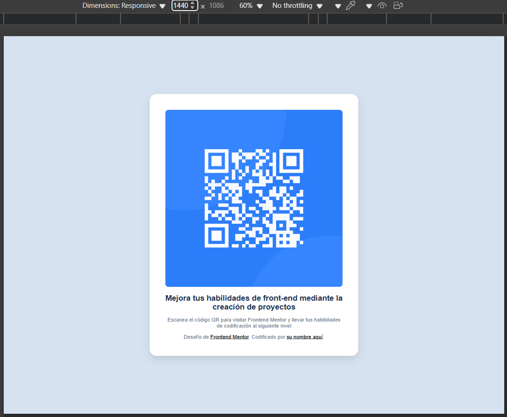

# Frontend Mentor - QR code component solution

Este es mi solución al desafío [QR code component](https://www.frontendmentor.io/challenges/qr-code-component-iux_sIO_H) de Frontend Mentor.

## Descripción

El proyecto consiste en un componente de tarjeta que muestra un código QR con un diseño responsivo y estilizado para practicar maquetación con HTML y CSS.

## Tecnologías usadas

- HTML5
- CSS3 (Flexbox y media queries)
- Fuentes de Google Fonts (`Outfit`)

## Características

- Diseño centrado vertical y horizontalmente en la página.
- Tarjeta con esquinas redondeadas y sombra para efecto de elevación.
- Colores basados en la guía de estilo del desafío.
- Comportamiento responsivo para distintas resoluciones de pantalla.

## Vista previa

## Cómo usar

1. Clona este repositorio o descarga los archivos.
2. Abre el archivo `index.html` en tu navegador.

## Créditos

- Desafío de [Frontend Mentor](https://www.frontendmentor.io).
- Hecho por [Helen Perez].

---
